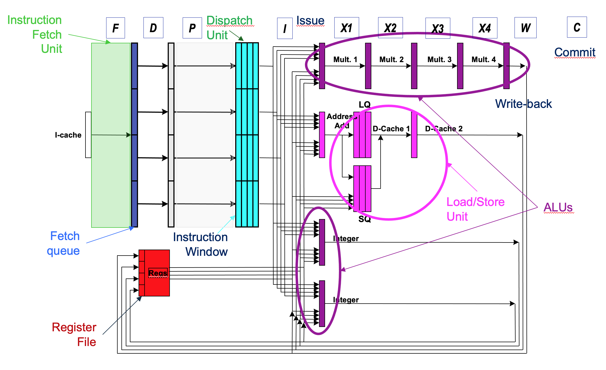
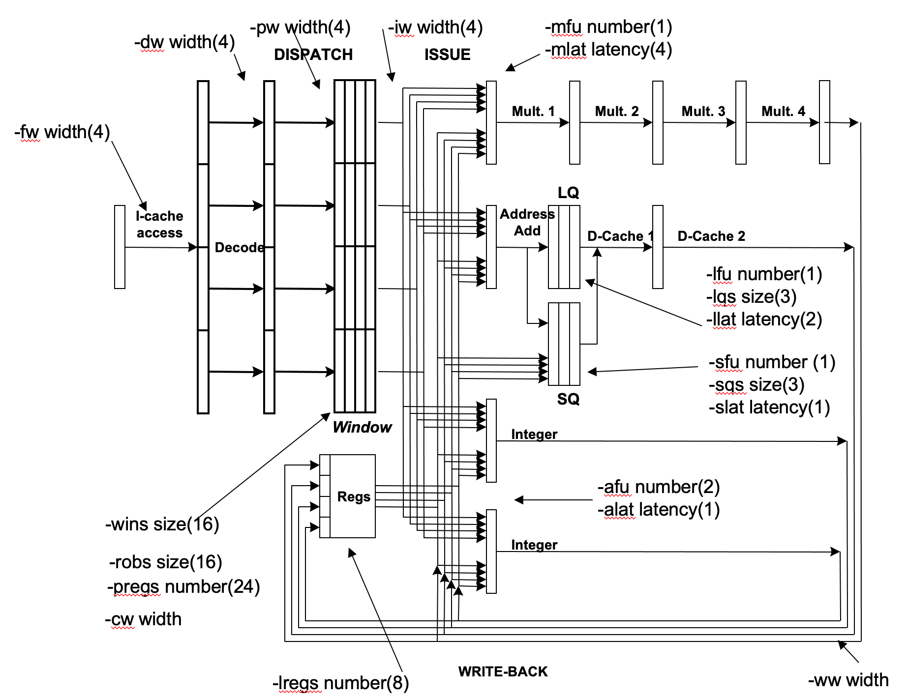

# freess
RISC-V Superscalar Educational Simulator based on Tomasulo's Algorithm

# to compile
make

# to run the examples
./run-ex1.sh
./run-ex2.sh
./run-ex3.sh

# to write your own RISC-V-like program
To write a program, students simply replace each mnemonic with its corresponding opcode, specify the register indices, and provide any required immediate values. The handling of branch instructions is particularly instructive: instead of using labels as in assembly, students must enter the immediate value representing the number of instructions to jump—positive for forward branches, negative for backward ones, effectively replacing the role of labels in `BEQ` and `BNE` instructions. For those unfamiliar with machine code, this exercise also provides a valuable opportunity to understand how binary files encode programs at the instruction level.

Table 1 reports the opcodes for the seven supported instructions.

**Table 1: FREESS instructions**

| Mnemonic | Operation Code (opcode) |
|----------|-------------------------|
| ADD      | 1                       |
| ADDI     | 2                       |
| LW       | 3                       |
| SW       | 4                       |
| BEQ      | 5                       |
| BNE      | 6                       |
| MUL      | 7                       |

Assuming the code:
`
loop: x3 <- mem(0+x4)   # load b(i)
      x7 <- mem(128+x5) # load c(i)
      x7 <- x7 * x3     # b(i) * c(i)
      x1 <- x1 - 1      # decr. counter
      mem(256+x6)<- x7  # store a(i)
      x2 <- x2 + 8      # bump index
      P <- loop; x1!=0  # close loop
`
the resulting code is the following (i.e., filename 'program1':

`
1 3 4 0
1 7 5 128
7 7 7 3
6 1 1 -1
2 7 6 256
6 2 2 8
4 1 0 -7
`

# running the program:
`
./freess -exe program1
`

# for help
`
./freess -h
`

